  

 

  <strong><code>I build AI systems that execute, not just chat. Local-first. Governed. Hardware-aware. Real.</code></strong>

 

  
  
  
  
  

 

---

### What I do

I design and build **CastelOS** — a local-first AI execution system that turns tasks into governed runs with real artifacts and evidence. Not another wrapper around an API. A full system: from GPU routing to policy enforcement to domain-specific knowledge packs.

Everything runs on one workstation I assembled myself. No cloud dependencies. No scattered SaaS. Just execution.

 

<table>
<tr>
  <td align="center" width="200">
     
    <b>Hardware-aware</b> 
    GPU/RAM routing, silicon to output
  </td>
  <td align="center" width="200">
     
    <b>Governed execution</b> 
    Policy layer, audit trail, every run tracked
  </td>
  <td align="center" width="200">
     
    <b>Knowledge flows</b> 
    Connected pipelines, not prompt chaos
  </td>
  <td align="center" width="200">
     
    <b>Domain packs</b> 
    Productized profiles for real workflows
  </td>
</tr>
</table>

 

---

  
  &nbsp;
  
  &nbsp;
  

