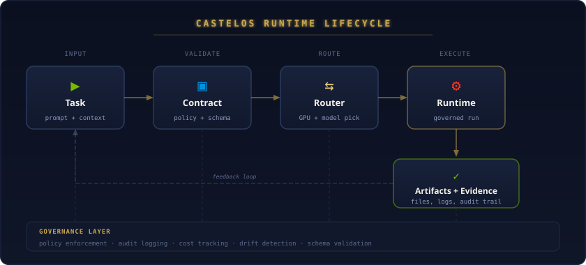

  

 

  <strong><code>I build AI systems that execute, not just chat. Local-first. Governed. Hardware-aware. Real.</code></strong>

 

  
  
  
  
  

 

---

### What I do

I design and build **CastelOS** — a local-first AI execution system that turns tasks into governed runs with real artifacts and evidence. Not another wrapper around an API. A full system: from GPU routing to policy enforcement to domain-specific knowledge packs.

Everything runs on one workstation I assembled myself. No cloud dependencies. No scattered SaaS. Just execution.

### Things you can run

The reusable pieces live in their own repos. None of them need CastelOS to be useful.

- **[awesome-local-ai](https://github.com/CastelDazur/awesome-local-ai)** is a curated list of tools for running models on your own hardware.
- **[gpu-memory-guard](https://github.com/CastelDazur/gpu-memory-guard)** stops one process from taking the whole GPU. `pip install gpu-memory-guard`
- **[llm-judge-jury](https://github.com/CastelDazur/llm-judge-jury)** puts several models to a vote on an output instead of trusting one judge.
- **[qlora-single-gpu-playbook](https://github.com/CastelDazur/qlora-single-gpu-playbook)** is the set of guards that kept my QLoRA runs alive on a single card.
- **[merge-quantize-keep-mtp](https://github.com/CastelDazur/merge-quantize-keep-mtp)** merges two LoRA adapters by rank, then verifies the MTP heads survive GGUF quantization.

 

  

 

 

---

  
  &nbsp;
  <a href="https://x.com/casteldazur">
